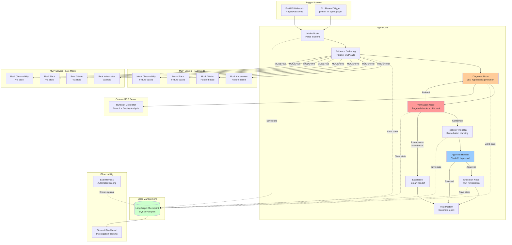
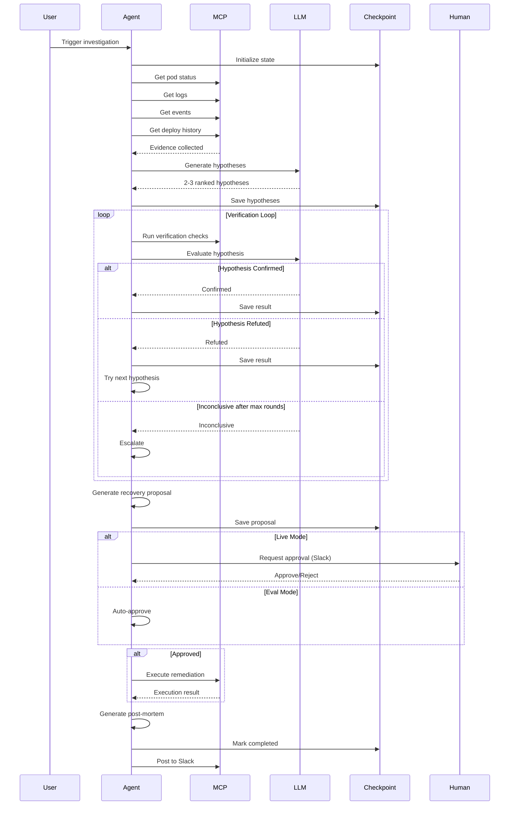
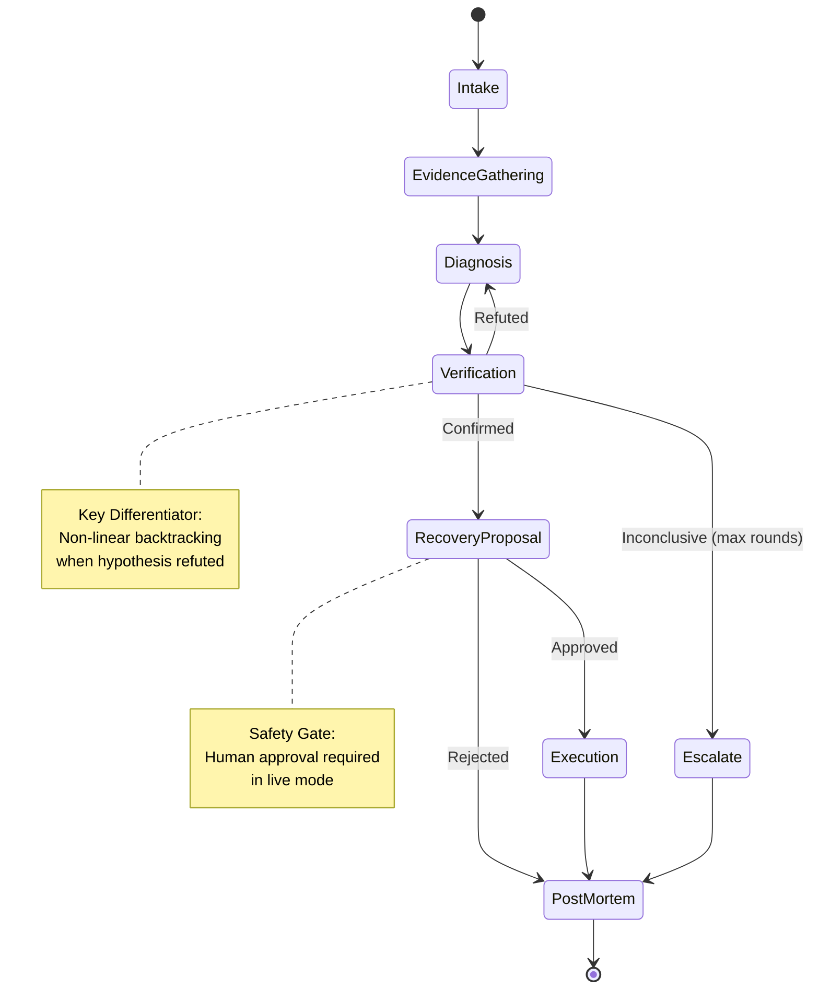
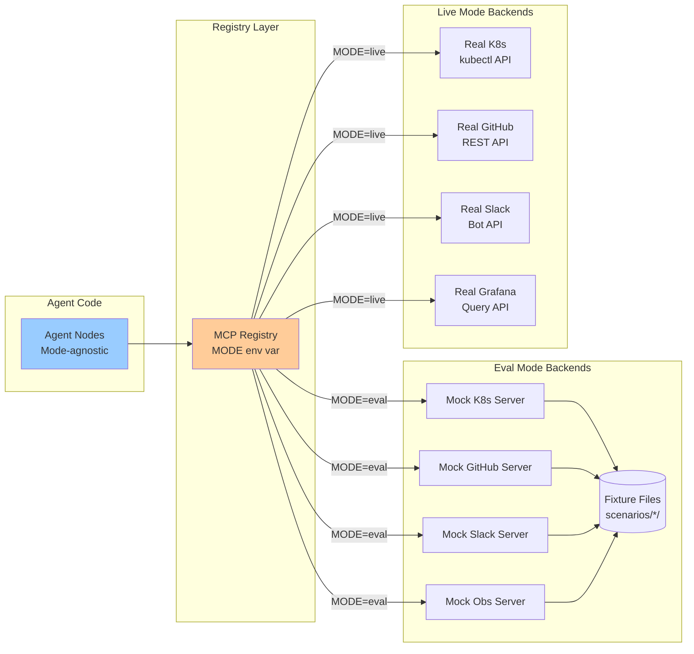

# AI Incident Response Engineer - Architecture

## System Overview



## Data Flow

### Investigation Lifecycle



## Component Architecture

### LangGraph State Machine



### MCP Server Registry



## Key Design Decisions

### 1. Non-Linear Graph Architecture

**Decision**: Use LangGraph with conditional routing instead of a linear pipeline.

**Rationale**:
- Real incident response requires hypothesis testing with backtracking
- Linear pipelines can't recover from incorrect hypotheses
- Conditional edges enable `refuted → diagnosis` loop

**Trade-offs**:
- ✅ More realistic agent behavior
- ✅ Can recover from wrong paths
- ❌ More complex to reason about
- ❌ Harder to debug state transitions

### 2. Dual-Mode MCP Architecture

**Decision**: Build mock and real MCP servers with transparent mode switching.

**Rationale**:
- Need deterministic eval scenarios with ground truth
- Can't use live APIs in CI/CD testing
- Agent code should be agnostic to backend

**Trade-offs**:
- ✅ Deterministic evaluation
- ✅ Offline development
- ✅ Easy testing
- ❌ Need to maintain two implementations
- ❌ Mock behavior might diverge from real

### 3. Hard Human-in-the-Loop Gate

**Decision**: Require explicit approval before any write action in live mode.

**Rationale**:
- Safety-critical system affecting production
- AI can make mistakes
- Need human judgment for remediation decisions

**Trade-offs**:
- ✅ Safe - prevents unauthorized actions
- ✅ Auditable approval trail
- ❌ Slower incident response
- ❌ Requires human availability

### 4. LangGraph Checkpointing

**Decision**: Use LangGraph's built-in checkpointing instead of custom state management.

**Rationale**:
- Investigations may span hours/days
- Need to survive process restarts
- Full state history for debugging

**Trade-offs**:
- ✅ Automatic state persistence
- ✅ Resumability
- ✅ Full audit trail
- ❌ Database dependency
- ❌ Increased storage usage

### 5. Action Type Allowlist

**Decision**: Hard-coded allowlist of permitted action types.

**Rationale**:
- Prevent novel/dangerous actions
- Explicit vs implicit safety
- Easy to audit and modify

**Trade-offs**:
- ✅ Predictable behavior
- ✅ Easy to reason about
- ❌ Less flexible
- ❌ Requires code change to add actions

## Scalability Considerations

### Current Limitations

**Single Investigation at a Time**:
- Current implementation processes one investigation per agent instance
- For concurrent investigations, run multiple agent processes

**Checkpoint Database**:
- SQLite for development (single-file database)
- Migrate to Postgres for production with concurrent access

**MCP Server Processes**:
- Each server runs as a subprocess
- For high load, consider server pooling or remote MCP servers

### Scaling Strategy

**Horizontal Scaling**:
```
Load Balancer
    ├─> Agent Instance 1 (handles investigation A)
    ├─> Agent Instance 2 (handles investigation B)
    └─> Agent Instance 3 (handles investigation C)
         │
         └─> Shared Postgres Checkpoint Database
```

**Async Processing**:
```
Webhook → Message Queue → Agent Workers → Checkpoint DB
                         ↓
                    Slack Notifications
```

## Security Model

### Threat Model

**In Scope**:
- Unauthorized remediation actions
- Credential leakage in logs
- Malicious input via webhooks

**Out of Scope** (for this demo):
- DDoS protection
- Rate limiting
- Multi-tenancy

### Security Controls

1. **Action Allowlist**: Only permitted actions can execute
2. **Approval Gate**: Human approval required in live mode
3. **Audit Logging**: All decisions logged with reasoning
4. **Credential Management**: Env vars, not hardcoded
5. **Input Validation**: Structured state types with TypedDict

## Performance Characteristics

### Latency

Typical investigation timeline (eval mode):

```
Intake:             ~0.1s  (parse manifest)
Evidence Gathering: ~1.0s  (parallel MCP calls)
Diagnosis:          ~3.0s  (LLM hypothesis generation)
Verification:       ~2.0s  (LLM evaluation + checks)
Recovery Proposal:  ~0.5s  (template remediation)
Execution:          ~0.5s  (simulated)
Post-Mortem:        ~0.5s  (generate report)
────────────────────────────
Total:              ~7.6s
```

Live mode adds:
- Real MCP server calls: +2-5s
- Human approval wait: +30s-5min
- Real remediation execution: +10-60s

### Cost

Per investigation (estimated):

```
LLM Calls:
  - Diagnosis: 1 call × 2000 tokens × $3/M = $0.006
  - Verification: 1-3 calls × 1000 tokens × $3/M = $0.003-$0.009
  ─────────────────────────────────────────────────
  Total per investigation: $0.009-$0.015

MCP Tool Calls: Free (local or API-specific costs)
```

Target: ≤ $0.015 per investigation (from eval goals)

## Monitoring and Observability

### Metrics Tracked

1. **Investigation Metrics**:
   - Time to diagnosis
   - Time to resolution
   - Verification rounds
   - Hypothesis acceptance rate

2. **System Metrics**:
   - Investigations per hour
   - Completion rate
   - Escalation rate
   - Average cost

3. **Quality Metrics** (from eval harness):
   - Root cause accuracy
   - Remediation acceptability

### Logging Strategy

```python
# Structured logging at each node
logger.info("Starting evidence gathering", extra={
    "thread_id": thread_id,
    "service": incident.service,
    "severity": incident.severity
})

# All tool calls logged
logger.info("MCP tool call", extra={
    "service": "kubernetes",
    "tool": "k8s_get_pod_status",
    "args": {...}
})
```

## Future Architecture Evolution

### Short Term

1. **Webhook Integration**: FastAPI endpoint for PagerDuty
2. **Slack Notifications**: Real-time updates during investigation
3. **Metrics Dashboard**: Grafana integration for agent metrics

### Long Term

1. **Multi-Incident Triage**: Queue and prioritize multiple incidents
2. **Learning from Past**: Fine-tune on successful investigations
3. **Proactive Monitoring**: Predict incidents before they occur
4. **Multi-Cloud**: Support AWS, GCP, Azure
5. **Plugin System**: Custom MCP servers for proprietary tools

## References

- [LangGraph Documentation](https://langchain-ai.github.io/langgraph/)
- [MCP Protocol Specification](https://modelcontextprotocol.io)
- [Anthropic API](https://docs.anthropic.com/claude/reference/getting-started)
