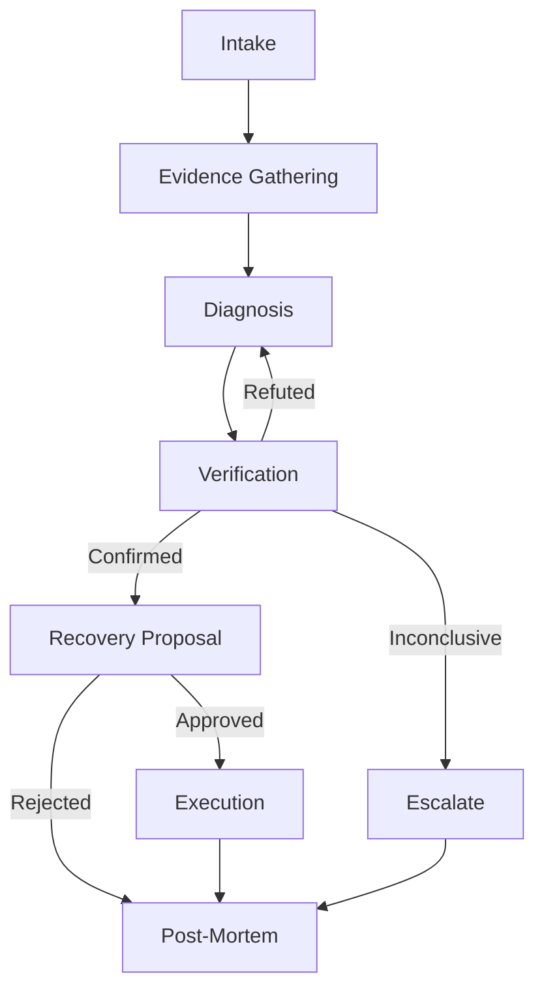

# AI Incident Response Engineer

An autonomous agent that triages, diagnoses, and helps remediate production incidents for Kubernetes-based services.

## Overview

This project implements an AI-powered incident response system that:
- Receives alerts via webhook or CLI
- Gathers evidence from observability and infrastructure tools via MCP
- Forms and verifies hypotheses about root causes with backtracking
- Proposes remediation actions with human-in-the-loop approval
- Executes approved fixes
- Generates comprehensive post-mortem reports

## Key Features

1. **Hypothesize-then-verify loop** with backtracking (not a linear pipeline)
2. **Hard human-in-the-loop gate** before any write action
3. **Durable state** via LangGraph checkpointing (investigations survive restarts)
4. **Custom MCP server** for runbook correlation and deploy analysis
5. **Real eval harness** with scripted incident scenarios

## Architecture



## Project Structure

```
.
├── agent/
│   ├── graph.py              # LangGraph wiring
│   ├── state.py              # State types
│   ├── nodes/                # One file per node
│   └── prompts/              # Versioned prompt templates
├── mcp_servers/
│   ├── mock/                 # Fixture-based mock MCP servers
│   │   ├── kubernetes.py
│   │   ├── github.py
│   │   ├── slack.py
│   │   ├── observability.py
│   │   └── README.md
│   ├── registry.py           # Mode-switching registry (eval/live)
│   └── runbook_correlator/   # Custom MCP server + README
├── fixtures/
│   ├── scenarios/            # Per-scenario fixture data
│   │   └── oom_after_deploy/
│   └── shared/               # Shared fixtures
├── webhook/                  # FastAPI app
├── dashboard/                # Streamlit UI
├── evals/
│   ├── scenarios/            # Eval scenario definitions
│   ├── runner.py
│   └── rubric.py
├── docker-compose.yml
├── pyproject.toml
└── README.md
```

## Mock MCP Servers

A key architectural decision: **The agent is agnostic to whether it's talking to real or mock MCP servers.**

```python
# Agent code works in both modes
from mcp_servers.registry import get_mcp_server

registry = get_mcp_server()  # MODE env var controls real vs mock
result = registry.call_tool("kubernetes", "k8s_get_pod_status", {...})
```

**In eval mode** (`MODE=eval`):
- Mock servers serve fixture data from `fixtures/scenarios/{scenario}/`
- Deterministic, reproducible results for evaluation
- No external dependencies (Kubernetes, GitHub, etc.)
- Fast execution for CI/CD

**In live mode** (`MODE=live`):
- Real MCP servers via stdio or HTTP
- Connects to actual Kubernetes clusters, GitHub API, etc.
- Used for production incident response

This dual-mode architecture enables:
- Development and testing without live infrastructure
- Reproducible eval scenarios with known ground truth
- Easy transition from eval to production use

See [`mcp_servers/mock/README.md`](mcp_servers/mock/README.md) for details.

## Setup

### Prerequisites

- Python 3.11+
- Docker and Docker Compose
- pip or uv

### Installation

```bash
# Clone the repository
git clone <repo-url>
cd ai-incident-response

# Install dependencies
pip install -e ".[dev]"

# Set up environment variables
cp .env.example .env
# Edit .env with your API keys
```

### Running Locally

```bash
# Start infrastructure (Postgres for checkpointing)
docker-compose up -d

# Run the webhook server
uvicorn webhook.main:app --reload

# In another terminal, run the dashboard
streamlit run dashboard/app.py

# Test with a sample incident
python -m agent.graph
```

## Development Status

**Current Phase:** Step 3 - Custom Runbook Correlator MCP Server ✅

- [x] State types defined
- [x] Skeleton graph with no-op nodes
- [x] Node placeholders created
- [x] Prompt templates initialized
- [x] Mock MCP servers (Kubernetes, GitHub, Slack, Observability)
- [x] MCP server registry with mode switching (eval/live)
- [x] Sample scenario with fixtures (oom_after_deploy)
- [x] Custom Runbook Correlator MCP server
  - [x] find_runbook tool (markdown corpus with YAML frontmatter)
  - [x] correlate_deploys tool (multi-factor suspicion scoring)
  - [x] similar_past_incidents tool (vector search with sentence-transformers + FAISS)
  - [x] Comprehensive protocol-level documentation
- [ ] End-to-end happy path
- [ ] Verification loop with backtracking
- [ ] Human-in-the-loop approval
- [ ] Checkpointing + resumability
- [ ] Eval harness
- [ ] Real MCP integrations
- [ ] Dashboard

## Current Eval Scores

*(To be populated once eval harness is built)*

| Metric | Score |
|--------|-------|
| Root Cause Accuracy | TBD |
| Remediation Acceptability | TBD |
| Avg Verification Rounds | TBD |
| Avg Cost per Incident | TBD |

## Limitations

*(To be documented based on observed failure modes during eval)*

- TBD

## License

MIT
